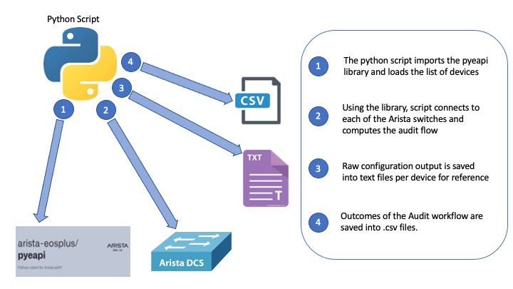

# AuditCheckAristaEOS
This repository is the result of an audit requirement for understanding the current state of devices within an Arista network. It is built to help engineers understand the state of their network by using the python pyeapi library from Arista EOS.

## Overview

**Specifc Use Case**: 

The specific use case for this repo is in situations where you just joined a company or are consulting on a network project and would like to have a clear picture of the network infrastructure from layer 1 and 2. It includes the mostly used layer 1 and 2 commands and extracts relevant data to evolve an actual picture of the infrastructure.

**Python**

The script is written in python using the pyeapi library from Arista to connect to devices, filter out specific information and store output in a CSV file.

**Genie** 

**Output**: The results of the CLI commands are stored in simple .txt file: (L1.txt) 

## Contacts
*Oluyemi Oshunkoya (yemi_o@outlook.com)

## Solution Components
*Pyeapi

*Python

## Prerequisites 

pyeapi
Python3.6 and above

## Installation

1. Clone this repository into your desired directory using the command:

git clone https://github.com/yzmar4real/AuditCheckAristaEOS.git

2. CD into the directory 

cd AuditCheckAristaEOS

3. Use the directory as a virtual environment for the project

python3 -m venv . 

4. Start the virtual environment and install the requirements for the project

source bin/activate

pip install pyeapi
pip install pandas

5. Edit the pyeapi load file (./eapi/.conf), and the devlist.csv files with your infrastructure setup.

6. Run the master script

python Main.py
